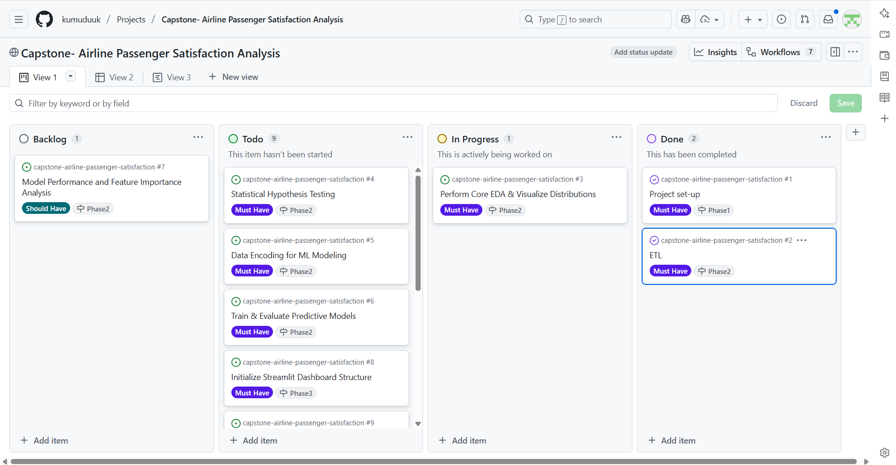

# ✈️ README: Airline Passenger Satisfaction Prediction

## 1. 📋 Dataset Content

The project utilizes data derived from an airline survey, combining two files (`train.csv` and `test.csv`). The dataset contains over 100,000 records of individual passenger experiences.

| Feature Name (Cleaned) | Description | Type |
| :--- | :--- | :--- |
| **`satisfaction`** | **Target Variable.** Passenger satisfaction level (1: Satisfied, 0: Neutral or Dissatisfied). | Binary (0/1) |
| **`Customer_Type`** | Loyal Customer or disloyal Customer. | Nominal |
| **`Type_of_Travel`** | Personal Travel or Business travel. | Nominal |
| **`Class`** | Travel Class (Business, Eco, Eco Plus). | Nominal |
| **`Age`** | Age of the passenger. | Numerical |
| **`Flight_Distance`** | Distance of the flight in miles. | Numerical |
| **`Departure/Arrival Delay`** | Delays in Minutes. | Numerical |
| **`Inflight_wifi_service`** | Rating of WiFi service (0–5). | Ordinal |
| **`Online_Boarding`** | Rating of online boarding experience (0–5). | Ordinal |
| **`Seat_Comfort`** | Rating of seat comfort (0–5). | Ordinal |
| **`Total_Service_Score`** | **Engineered Feature.** Sum of all 12 core service ratings (0–60). | Numerical |

## 2. 🎯 Business Requirements

### The Client

The client is the **Airline Management Team**.

**Goal:** The primary goal is to maximize passenger satisfaction by definitively identifying which core flight and digital services drive customer happiness most. This knowledge will guide resource allocation and service improvement investments.

### The Business Requirements

| ID | Business Requirement | Validation Phase |
| :--- | :--- | :--- |
| **BR1** | Identify and quantify the relationship (correlation) between key operational factors (e.g., travel class, loyalty, delay) and passenger satisfaction. | EDA & Hypothesis Testing |
| **BR2** | Build a robust predictive model capable of classifying a passenger as 'Satisfied' or 'Dissatisfied' based on their profile and service ratings, allowing for real-time risk assessment. | Predictive Modeling |
## 3. 🏗️ Project Management

* **Kanban Board:** [Link to GitHub Project Board](https://github.com/users/kumuduuk/projects/4/views/1)


## 3. 🧪 Hypothesis and Validation

The following hypotheses were tested using the cleaned, engineered data:

| Hypothesis | Validation Method | Statistical Conclusion |
| :--- | :--- | :--- |
| **Hypothesis 1:** Type of travel significantly affects satisfaction. | Independent Samples T-test ($\text{H}_0$: Mean satisfaction is the same). | **Rejected $\text{H}_0$.** Business travel is highly correlated with satisfaction. |
| **Hypothesis 2:** Customer loyalty correlates with higher satisfaction. | Chi-Squared Test of Independence ($\text{H}_0$: No association between loyalty and satisfaction). | **Rejected $\text{H}_0$.** Loyalty is strongly associated with satisfaction. |
| **Hypothesis 3:** High service scores correlate with higher satisfaction. | Independent Samples T-test ($\text{H}_0$: Mean satisfaction is the same for High vs. Low Service Flag). | **Rejected $\text{H}_0$.** The engineered `Total_Service_Score` is highly predictive. |
| **Hypothesis 4:** Travel Class affects passenger satisfaction. | Chi-Squared Test of Independence ($\text{H}_0$: No association between Class and satisfaction). | **Rejected $\text{H}_0$.** Business Class has significantly higher satisfaction. |
| **Hypothesis 5:** Longer flight delays decrease passenger satisfaction. | Independent Samples T-test (Welch's) ($\text{H}_0$: Mean delay is the same for satisfied vs. dissatisfied groups). | **Rejected $\text{H}_0$.** Longer delays are significantly associated with lower satisfaction. |

## 4. 🗺️ The Rationale to Map Business Requirements to Tasks

| Business Requirement | Data Analytics Task | Rationale |
| :--- | :--- | :--- |
| **BR1: Correlation Study** | **EDA, Data Visualization, and Statistical Hypothesis Testing.** | Visual analysis (e.g., count plots, box plots) identifies patterns, while $\chi^2$ and T-tests formally prove if the relationships (e.g., Class vs. Satisfaction) are statistically significant, providing actionable business insights. |
| **BR2: Prediction Model** | **Classification Analysis (Random Forest).** | Building a classification model predicts the binary outcome (`satisfied` or `dissatisfied`). The model's feature importance scores formally quantify which individual services drive satisfaction most (Hypothesis 4), guiding investment decisions. |

## 5. 💼 ML Business Case: Predicting Passenger Satisfaction

**Objective:** To predict whether a new passenger will be 'Satisfied' (1) or 'Dissatisfied' (0) based on their profile and service ratings.

**Model Type:** Supervised Binary Classification.

### What are the business requirements?
The model directly addresses **BR2** by providing a predictive tool and indirectly addresses **BR1** by providing definitive feature importance insights.

### Does the client need a dashboard?
Yes. The client requires an interactive dashboard (Streamlit) for two purposes:
1.  To visually validate the analytical findings (BR1).
2.  To provide a real-time tool for predicting satisfaction for new profiles.

### What is the successful outcome?
The model is considered successful if it achieves high predictive accuracy, prioritizing the correct identification of both satisfied and dissatisfied customers.

**Success Criteria:**
* **AUC Score $\geq 0.95$** (Measures the model's ability to discriminate between classes).
* **F1-Score $\geq 0.90$** (A balanced metric for precision and recall, essential for slightly imbalanced data).

**Final Model Performance:**
| Model | AUC Score | F1-Score | Result |
| :--- | :--- | :--- | :--- |
| **Random Forest (Final)** | **0.9918** | **0.95** | **Success.** Exceeded all criteria. |

## 6. 🎨 Dashboard Design (Streamlit)

The Streamlit dashboard (`streamlit_dashboard.py`) is organized for clear communication and interactive modeling:

> [Airline Customer Satisfaction Dashboard](https://capstone-airline-passenger-satisfaction.streamlit.app/)

| Page | Content & Purpose |
| :--- | :--- |
| **Sidebar (Prediction)** | Interactive sliders and select boxes for passenger profile and service ratings. Includes a dedicated "Predict" button that uses the saved Random Forest model. |
| **Main Page: Introduction** | Project title, objective, and a brief overview of the data and modeling approach. |
| **Main Page: Segment Insights (H1, H2, H4)** | Visualizations (Count Plots) showing the correlation between **Customer Type**, **Type of Travel**, and **Class** versus **Satisfaction** (addressing BR1). |
| **Main Page: Feature Impact (H3, H5)** | Boxplots showing the distribution of the **Total Service Score** and **Departure Delay** for satisfied vs. dissatisfied passengers. |
| **Main Page: Model Summary** | Technical table comparing the performance of the **Logistic Regression Baseline** vs. the **Random Forest Final Model** (addressing BR2). |

## 7. 🐞 Unfixed Bugs

The project is currently stable and all known critical bugs were fixed during development.

| Issue | Description & Solution |
| :--- | :--- |
| **Initial `SyntaxError` (Windows Path)** | **Description:** A `SyntaxError` (`unicodeescape` codec error) occurred due to Python misinterpreting backslashes (`\`) in the absolute Windows file path. |
| | **Solution:** The path definition was replaced using the `pathlib.Path` module with the **raw string prefix (`r"..."`)** and verified with forward slashes to ensure correct interpretation across environments. |
| **Streamlit `KeyError` (Prediction)** | **Description:** A `KeyError` (`'Online_Boarding'`) occurred during prediction when attempting to assign values from an intermediate dictionary that was incorrectly structured. |
| | **Solution:** The prediction logic was refactored to directly assign the user input variables (e.g., `online_boarding`) to the `input_df` DataFrame columns, eliminating the unreliable intermediate dictionary. |
| **Seaborn `ValueError` (Plotting)** | **Description:** The visualizations failed because the target variable (`satisfaction`) was read as an integer, but the provided Seaborn palette used string keys (`'0'`, `'1'`). |
| | **Solution:** The `satisfaction` column in the loaded visualization data (`df_train`) was explicitly cast to `str` type, ensuring consistency with the palette keys. |

## 8. ⚙️ Deployment

The application is designed for easy deployment.

### Streamlit (Cloud Deployment)

1.  Push the entire project folder to a GitHub repository.
2.  Ensure the file structure is correct: `final_satisfaction_pipeline.pkl` and the `data/` folder should be in the root, and `streamlit_dashboard.py` should be in the `streamlit/` folder.
3.  Deploy the main file path: `streamlit/streamlit_dashboard.py` on Streamlit Cloud.

### Local Development

1.  **Clone the repository:**
    ```bash
    git clone <your-repository-url>
    cd capstone-airline-passenger-satisfaction
    ```
2.  **Setup Virtual Environment:**
    ```bash
    python -m venv .venv
    source .venv/bin/activate   # Linux/Mac
    .venv\Scripts\activate      # Windows
    ```
3.  **Install Dependencies:**
    ```bash
    pip install -r requirements.txt
    ```
4.  **Run the application from the root folder:**
    ```bash
    streamlit run streamlit/streamlit_dashboard.py
    ```

## 9. 📚 Main Data Analysis and Machine Learning Libraries

| Library | Purpose |
| :--- | :--- |
| **Pandas** | Data loading, cleaning (ETL), manipulation, and feature engineering. |
| **NumPy** | High-performance numerical computations (arrays, aggregates). |
| **Scikit-learn** | Predictive modeling (Logistic Regression, Random Forest), preprocessing (Scaling, Encoding), and evaluation (AUC, F1-Score). |
| **Matplotlib / Seaborn** | Static and statistical data visualization (EDA and dashboard plots). |
| **Streamlit** | Development and deployment of the interactive web dashboard. |
| **Joblib** | Serialization and saving of the final machine learning pipeline (`.pkl`). |
| **SciPy** | Statistical hypothesis testing ($\chi^2$, T-tests). |

## 10. ⭐️ Credits

| Category | Reference |
| :--- | :--- |
| **Content & Logic** | Project workflow derived from Data Analytics Course Capstone requirements. Statistical analysis and modeling adapted from standard Scikit-learn documentation. |
| **Media & Data** | The `train.csv` and `test.csv` datasets were provided for this capstone project. |